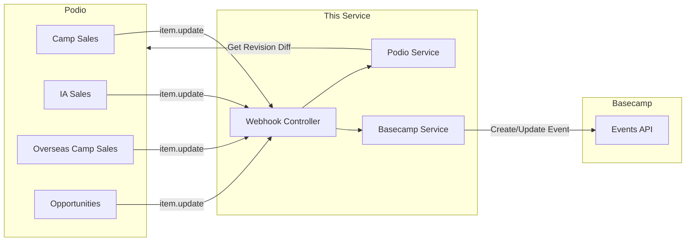
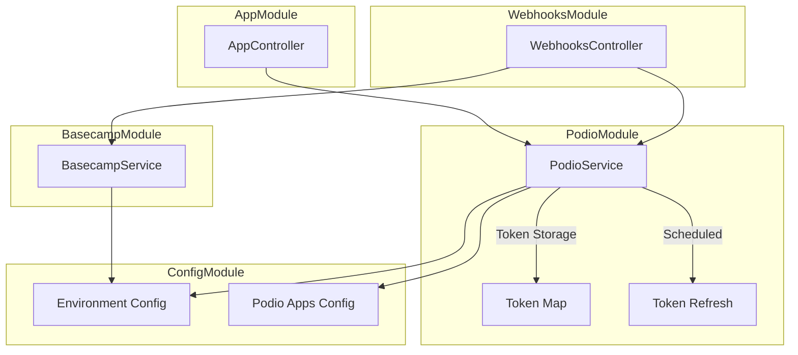
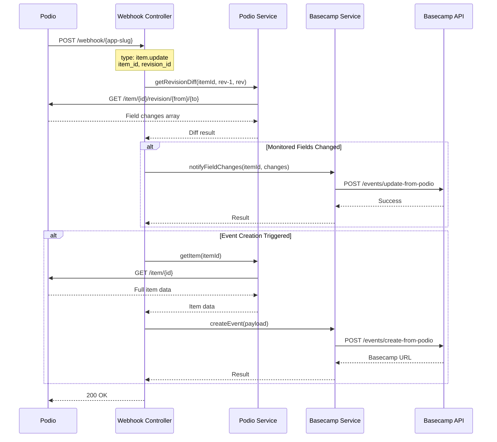
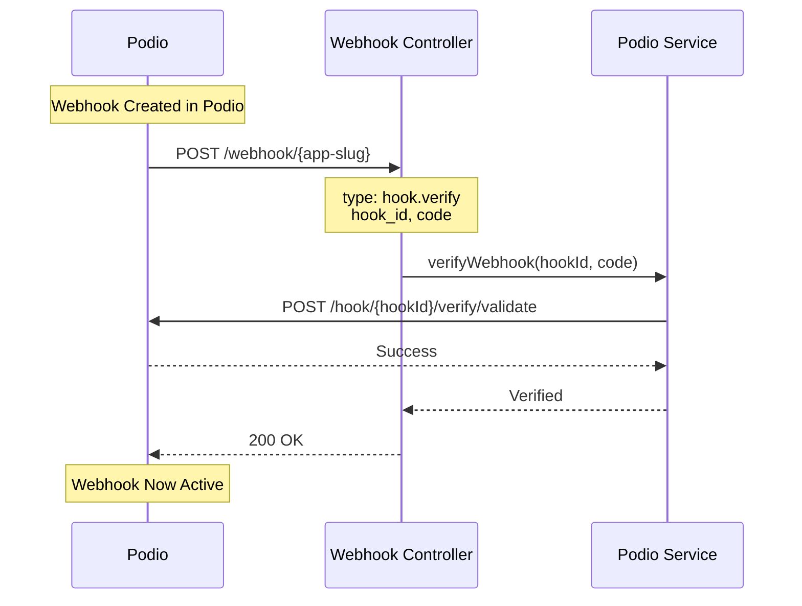
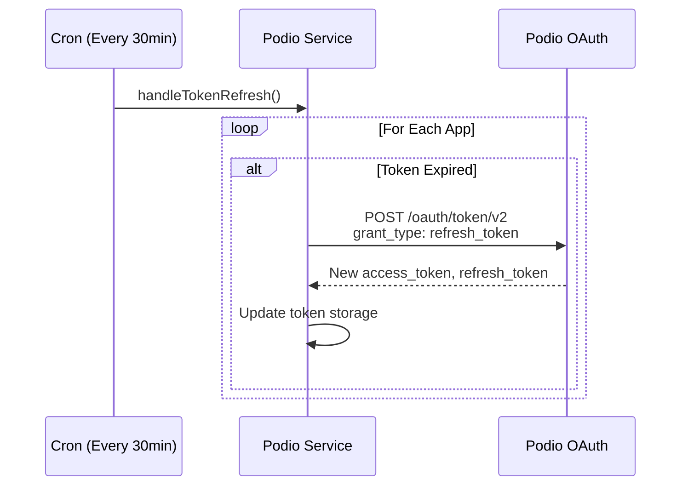
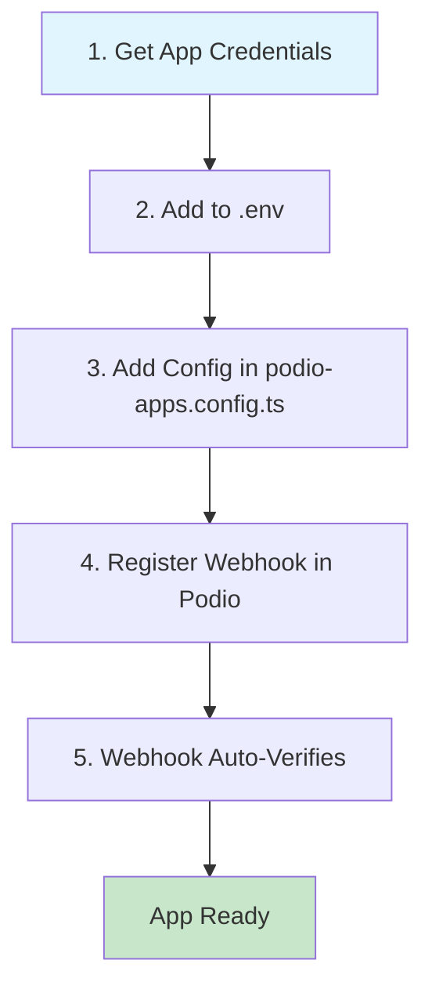
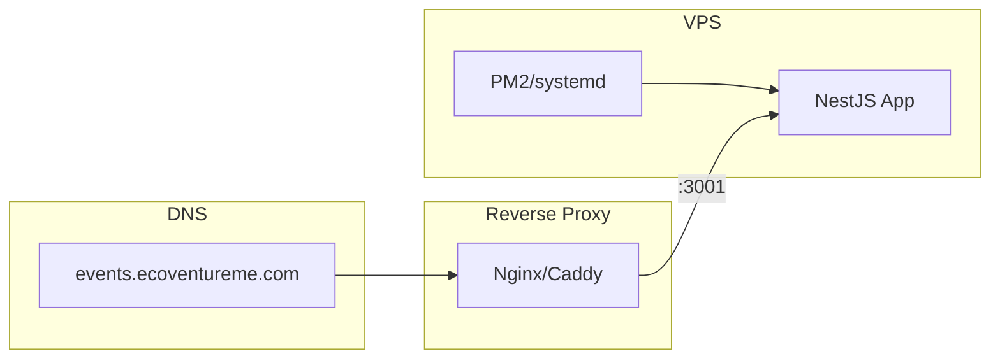
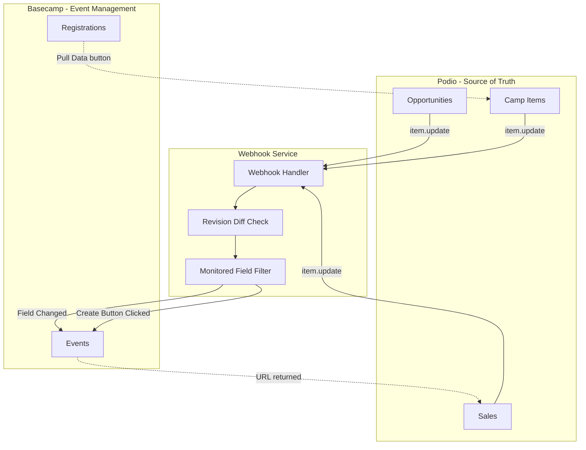

# Eco Podio Webhook

A NestJS application that handles Podio webhooks and synchronizes data with Basecamp for Ecoventure event management.

## Overview

This service acts as a bridge between Podio (sales pipeline) and Basecamp (event management). It listens for changes in Podio apps via webhooks and triggers appropriate actions on Basecamp.



## Architecture

### Module Structure



### Project Structure

```
src/
├── config/
│   └── podio-apps.config.ts    # Podio app configurations
├── podio/
│   ├── podio.module.ts
│   └── podio.service.ts        # OAuth, API calls, token management
├── basecamp/
│   ├── basecamp.module.ts
│   └── basecamp.service.ts     # Basecamp API integration
├── webhooks/
│   ├── webhooks.module.ts
│   └── webhooks.controller.ts  # Webhook endpoints
├── app.module.ts
├── app.controller.ts           # Health check & status
└── main.ts
```

## Webhook Flow

### Item Update Flow



### Webhook Verification Flow



### OAuth Token Refresh



## Webhook Endpoints

| Endpoint | App | Description |
|----------|-----|-------------|
| `POST /webhook/camp-sales` | Camp Sales | Local residential camps |
| `POST /webhook/ia-sales` | IA Sales | International Awards sales |
| `POST /webhook/overseas-camp-sales` | Overseas Camp Sales | International camps |
| `POST /webhook/opportunities` | Opportunities | Sales opportunities |

## Configuration

### Environment Variables

Create a `.env` file based on `.env.example`:

```bash
# Podio API Credentials (shared)
PODIO_CLIENT_ID=your_client_id
PODIO_CLIENT_SECRET=your_client_secret

# Podio App Credentials - Camp Sales
PODIO_APP_CAMP_SALES_ID=your_app_id
PODIO_APP_CAMP_SALES_TOKEN=your_app_token

# Podio App Credentials - IA Sales
PODIO_APP_IA_SALES_ID=your_app_id
PODIO_APP_IA_SALES_TOKEN=your_app_token

# Podio App Credentials - Overseas Camp Sales
PODIO_APP_OVERSEAS_CAMP_SALES_ID=your_app_id
PODIO_APP_OVERSEAS_CAMP_SALES_TOKEN=your_app_token

# Podio App Credentials - Opportunities
PODIO_APP_OPPORTUNITIES_ID=your_app_id
PODIO_APP_OPPORTUNITIES_TOKEN=your_app_token

# Basecamp API
BASECAMP_API_URL=https://events.ecoventureme.com/api

# Server
PORT=3001
```

### Monitored Fields

Each app has configured fields that trigger Basecamp sync when changed. Edit `src/config/podio-apps.config.ts`:

```typescript
{
  name: 'Camp Sales',
  slug: 'camp-sales',
  appId: process.env.PODIO_APP_CAMP_SALES_ID,
  appToken: process.env.PODIO_APP_CAMP_SALES_TOKEN,
  monitoredFields: [
    'registration-end-date',
    'event-dates',
    'teacher',
    'additional-school-charge',
  ],
  eventCreationTriggerField: 'create-on-basecamp',
  eventCreationTriggerValue: 'yes',
}
```

## Adding a New Podio App



### Steps:

1. **Get App Credentials**
   - Go to your Podio app → Settings → Developer
   - Copy the App ID and App Token

2. **Add to `.env`**
   ```bash
   PODIO_APP_NEW_APP_ID=12345
   PODIO_APP_NEW_APP_TOKEN=abc123
   ```

3. **Add Config** in `src/config/podio-apps.config.ts`:
   ```typescript
   {
     name: 'New App',
     slug: 'new-app',
     appId: process.env.PODIO_APP_NEW_APP_ID || '',
     appToken: process.env.PODIO_APP_NEW_APP_TOKEN || '',
     monitoredFields: ['field-1', 'field-2'],
   }
   ```

4. **Register Webhook in Podio**
   - Go to app → Settings → Developer → Add Webhook
   - URL: `https://your-domain.com/webhook/new-app`
   - Event: `item.update`

5. **Auto-Verification**
   - The service automatically handles `hook.verify` requests

## Setup & Development

### Prerequisites

- Node.js 18+
- pnpm

### Installation

```bash
pnpm install
```

### Running

```bash
# Development (with hot reload)
pnpm run start:dev

# Production
pnpm run build
pnpm run start:prod
```

### Local Testing with ngrok

```bash
# Start the server
pnpm run start:dev

# In another terminal, expose via ngrok
ngrok http 3001

# Use the ngrok URL for webhook registration
# https://abc123.ngrok.io/webhook/camp-sales
```

## API Endpoints

### Status & Health

| Method | Endpoint | Description |
|--------|----------|-------------|
| `GET /` | Status | Returns service info and configured webhooks |
| `GET /health` | Health Check | Returns `{ status: 'ok', timestamp: '...' }` |

### Webhooks

| Method | Endpoint | Description |
|--------|----------|-------------|
| `POST /webhook/:appSlug` | Webhook Handler | Receives Podio webhook events |

## Deployment

### VPS Deployment



1. **Build the application**
   ```bash
   pnpm run build
   ```

2. **Copy to server**
   ```bash
   scp -r dist/ package.json pnpm-lock.yaml .env user@server:/app/
   ```

3. **Install dependencies on server**
   ```bash
   cd /app && pnpm install --prod
   ```

4. **Run with PM2**
   ```bash
   pm2 start dist/main.js --name eco-podio-webhook
   pm2 save
   ```

5. **Configure reverse proxy** (Nginx example)
   ```nginx
   server {
       listen 443 ssl;
       server_name webhooks.ecoventureme.com;

       location / {
           proxy_pass http://localhost:3001;
           proxy_http_version 1.1;
           proxy_set_header Upgrade $http_upgrade;
           proxy_set_header Connection 'upgrade';
           proxy_set_header Host $host;
           proxy_cache_bypass $http_upgrade;
       }
   }
   ```

## Data Flow Summary



## Related Documentation

- [Podio API Documentation](https://developers.podio.com/)
- [Podio Webhooks Guide](https://developers.podio.com/doc/hooks)
- [Integration Tasks](./podio-basecamp-integration-tasks.md)

## License

Private - Ecoventure
